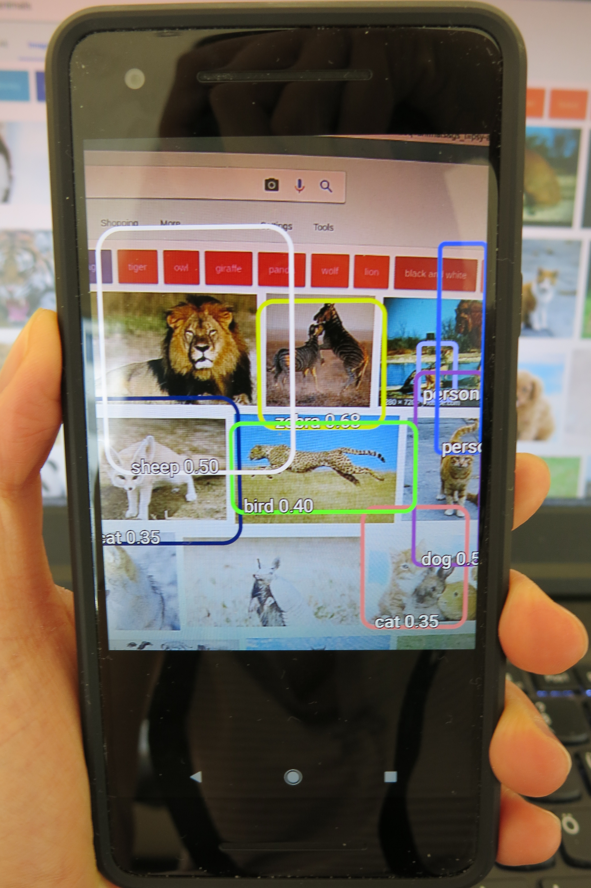

# Introduction
A stand-alone Android app ported from Tensorflow `TF detect` in `1.4.0` modified with `Yolo V2 coco`.

# Getting started
- [Install Android Studio](https://developer.android.com/studio/install.html)
- Import the project on Android Studio `File->New->Project from Vision Control->GitHub` or `git clone` this repository and import this project to Android Studio. 
- Install missing dependencies in Android Studio, it's smart enough to walk you through the installation steps. e.g. you probablly need to install `CMake`, mark the checkbox `CMake` under `Tools > Android > SDK Manager`. For more details, see [Add C and C++ Code to Your Project](https://developer.android.com/studio/projects/add-native-code.html).
- DONE, just run the app on your smartphone!

# Demo

**Err, close enough** Does that leopard look like a bird? :p Blame `coco` for not having enough classes. (powered by my Google Pixel 2)<br/>




<br/>

# Download the latest pretrained model Yolo v2 (optional)

### Tiny YOLO with coco labels (80 classes)
You can find the `pb` model generated from `cfg` and `weights` under `app/src/main/assets` or download the latest one from here:
- [cfg](https://github.com/pjreddie/darknet/blob/master/cfg/tiny-yolo.cfg)
- [weights](https://pjreddie.com/media/files/tiny-yolo.weights) <br/>

However, if you're interested in other YOLO models, download more `cfg` and weights from :boom: [DARKNET](https://pjreddie.com/darknet/yolo/).
Make sure always download the matching `cfg` and `weights` otherwise you won't be able to generate a `.pb` model. 

### Convert the pretrained model to a protobuf file `.pb`
To start `TF detect` in YOLO mode, you need to feed it with a YOLO model in `.pb`. I forked the tool from [Darkflow](https://github.com/thtrieu/darkflow)
and adapted it to the latest YOLO model, so basically, you just need to run 

`python3 flow --model cfg/tiny-yolo.cfg --load bin/tiny-yolo.weights --savepb --verbalise`

If you're interested in details of the modification, see the `troubleshooting` section of [my forked Darkflow](https://github.com/nicolefinnie/DarkEllie)


# Keep up with tensorflow libraries and co.

I may write a python script to pull those updates when I have time :see_no_evil: 
 
- `gradle/wrapper/*.jar`: [latest libraries](https://github.com/tensorflow/tensorflow/tree/master/tensorflow/examples/android/gradle/wrapper)
- `app/src/main/cpp/`: [latest libraries](https://github.com/tensorflow/tensorflow/tree/master/tensorflow/examples/android/jni) <br/>

You have to be careful, when you pull the native C libraries from [tensorflow jni](https://github.com/tensorflow/tensorflow/tree/master/tensorflow/examples/android/jni), 
you need to change the paths of `#include` header files in a programmatic way, because the relative path has changed in the android app structure. <br/>
For example: 

```
#include "tensorflow/examples/android/jni/rgb2yuv.h"  (in tensorflow repo)
#include "rgb2yuv.h" (stand-alone android app)
```

and `build.gradle` will call `CMakeList.txt` to compile all native libraries for you. There's nothing more you need to do. Awesome! :muscle:

# Reference 
- [Tensorflow repository for Android](https://github.com/tensorflow/tensorflow/tree/master/tensorflow/examples/android)
- [Stand-alone Android TF Classify app](https://github.com/Nilhcem/tensorflow-classifier-android) and it's [fun tutorial](http://nilhcem.com/android/custom-tensorflow-classifier)
- [Darknet - where YOLO was born](https://pjreddie.com/darknet/yolo/)
- [Darflow - tool for everything](https://github.com/thtrieu/darkflow)

